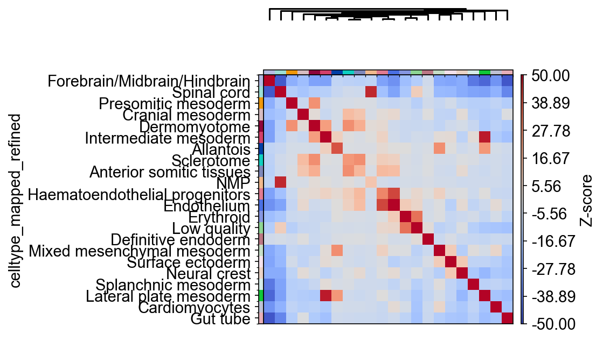

# Introduction

This vignette will demonsrate to the user how to reproduce some figures from the
Squidpy [manuscript][]. The authors of squpidpy documented their work via a
[Jupyter notebook][] that we then translated into R code. The steps below use
the R package reticulate to translate python code into R code that then create 
figures from the manuscript. Reticulate makes it very easy to use python code 
within R with very few changes. We will do a couple comparisons between python 
code and the reticulate R code to demonstrate where changes may have to be made.

[manuscript]: https://www.nature.com/articles/s41592-021-01358-2#Sec24
[Jupyter notebook]: https://github.com/theislab/squidpy_reproducibility/blob/master/notebooks/graph_figures/seqfish.ipynb

# Set up


## Import python packages

Reticulate has a very convenient function for importing the python libraries
needed to perform certain tasks. It is important to note that the environment
where squidpy was installed should be active in order for this code to work.

For examples, I named my conda environment squidpy so I'll run `conda activate
squidpy` before running the follow code in R.

```{python py_import, include = FALSE}
import scanpy as sc
import squidpy as sq
import matplotlib.pyplot as plt
import seaborn as sns
import pandas as pd
import numpy as np

from squidpy.pl._utils import save_fig
```

```{r import}
sc <- reticulate::import("scanpy")
sq <- reticulate::import("squidpy")
plt <- reticulate::import("matplotlib.pyplot")
sns <- reticulate::import("seaborn")
pd <- reticulate::import("pandas")
np <- reticulate::import("numpy")
```

## Settings {.tabset-pills}

There are some setting that are set in the Jupyter notebook that can be done
here as well. When converting python code to R code any `.` will become a `$`.
The first code chunk is a python code chunk and then the following code chunk
would be the corresponding R code. Some settings did not translate so I will
comment them out in the python code.

### Python code
```{python settings}
sc.logging.print_header()
sc.set_figure_params(facecolor="white", figsize=(8, 8))
sc.settings.verbosity = 3
#sc.settings.dpi = 300
#sq.__version__
sc.settings.figdir = "./figures"
```

### R code
```{r set_up}
sc$logging$print_header()
sc$set_figure_params(facecolor="white", figsize = c(8,8))
sc$settings$verbosity = 'hint'
sc$settings$figdir = "./figures"

PATH_FIGURES = "./figures"
```

## Obtain data

The data used is provided as part of the squpidpy package. We load it into R
with the following code, note that is is an anndata object.

```{python py_data, include = FALSE}
adata = sq.datasets.seqfish()
```


```{r data}
adata <- sq$datasets$seqfish()
adata # 19416 obs x 351 vars
```

# Figures

For the rest of this vignette we will be following the Jupyter notebook and
translating the python code to R. Each plot is created and saved in the figures
directory for future use.

## Figure 1

```{r fig1, dev = "png"}
sc$pl$spatial(
    adata,
    color = "celltype_mapped_refined",
    save = "_seqfish.png",
    spot_size = 0.03
)
```


## Figure 2

For this figure we will show the python code and the corresponding R code to
demonstrate where there may be some differences. 

```{python figure2}
sq.gr.spatial_neighbors(adata, delaunay=True)
sq.gr.nhood_enrichment(adata, cluster_key="celltype_mapped_refined", n_perms=1000)

arr = np.array(adata.uns["celltype_mapped_refined_nhood_enrichment"]["zscore"])

sq.pl.nhood_enrichment(
    adata,
    cluster_key="celltype_mapped_refined",
    cmap="coolwarm",
    title="",
    method="ward",
    dpi=300,
    figsize=(5, 4),
    save="nhod_seqfish.png",
    cbar_kwargs={"label": "Z-score"},
    vmin=-50,
    vmax=50,
)
```

```{r fig2, dev = "png"}
sq$gr$spatial_neighbors(adata, delaunay = TRUE) # added to adata.obsp, adata.uns
sq$gr$nhood_enrichment(adata, cluster_key = "celltype_mapped_refined", n_perms = 100) # added to adata.uns

arr <- np$array(adata$uns["celltype_mapped_refined_nhood_enrichment"]["zscore"])

sq$pl$nhood_enrichment(
    adata,
    cluster_key = "celltype_mapped_refined",
    cmap = "coolwarm",
    title = "",
    method = "ward",
    dpi = 300,
    figsize = c(5, 4),
    save = "nhood_seqfish.png",
    cbar_kwargs = list(label = "Z-score"),
    vmin = -50,
    vmax = 50
)
```



## Figure 3

```{r fig3, dev = "png"}
sq$pl$nhood_enrichment(
    adata,
    cluster_key = "celltype_mapped_refined",
    cmap = "inferno",
    title = "",
    method = "ward",
    dpi = 300,
    figsize = c(5, 4),
    save = "nhod_seqfish.png",
    cbar_kwargs = list(label = "Z-score"),
    vmin = -50,
    vmax = 150
)
```


## Figure 4

```{r fig4, dev = "png"}
ax <- plt$subplots(
    figsize = c(3, 6)
)
sc$pl$spatial(
    adata,
    color = "celltype_mapped_refined",
    groups = c(
        "Endothelium",
        "Haematoendothelial progenitors",
        "Allantois",
        "Lateral plate mesoderm",
        "Intermediate mesoderm",
        "Presomitic mesoderm",
        "Dermomyotome"
    ),
    save = "_endo_seqfish.png",
    frameon = FALSE,
#    ax = ax,
    show = FALSE,
    spot_size = 0.03
)
```


## Figure 5

```{r fig5, dev = "png"}
sc$pl$spatial(
    adata,
    color = "celltype_mapped_refined",
    groups = c(
        "Allantois",
        "Lateral plate mesoderm",
        "Intermediate mesoderm",
        "Presomitic mesoderm"
    ),
    save = "_meso_seqfish.png",
    spot_size = 0.03,
#    ax = ax,
    show = FALSE
)
```


## Figure 6

```{r fig6, dev = "png"}
sq$gr$co_occurrence(
    adata,
    cluster_key = "celltype_mapped_refined"
) # added to adata.uns


sq$pl$co_occurrence(
    adata,
    cluster_key = "celltype_mapped_refined",
    clusters = "Lateral plate mesoderm",
    figsize = c(5, 3),
    legend = FALSE,
    dpi = 300,
    save = "co_occurrence_seqfish"
)
```


